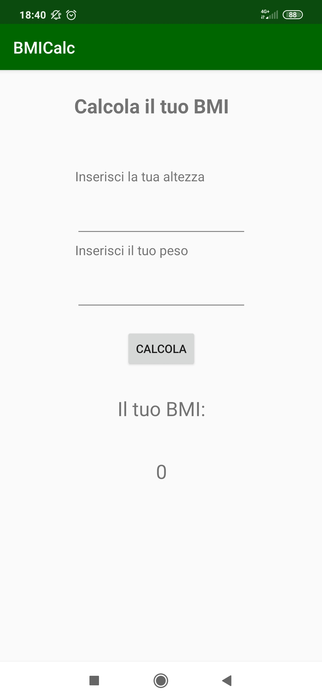
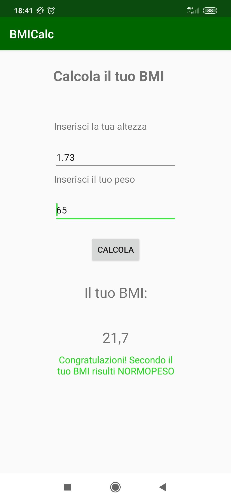

# BMICalc
## Description
This is a very simple Android app which has the purpose to learn developing app. This simple app shows which is your Body Mass Index (BMI) based on your parameters (height and weight). It also shows your current status based on the result.

## How to install it
To install you should find the .apk file into the app folder, named "bmicalc-debug.apk", which can be installed on your device by enabling "Install from unknown sources" on it.

